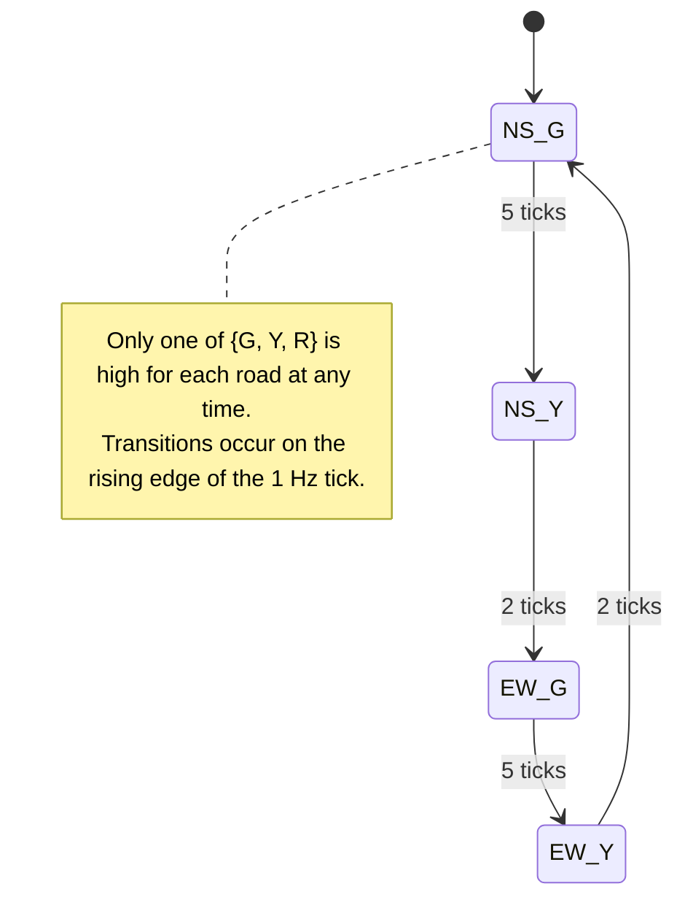

# Moore Traffic Light Controller (Two-Road: NS/EW)

## Description
This project implements a Moore traffic light controller for a two-road intersection (North-South and East-West). The state machine controls the traffic lights using a shared 1 Hz tick, ensuring safe sequencing of Green (G), Yellow (Y), and Red (R) lights.

---

## Timing Sequence
The traffic light follows a fixed timing sequence based on ticks:

| **Phase** | **Duration (ticks)** | **NS Light** | **EW Light** |
| --------- | ------------------- | ------------ | ------------ |
| 1         | 5                   | G            | R            |
| 2         | 2                   | Y            | R            |
| 3         | 5                   | R            | G            |
| 4         | 2                   | R            | Y            |

The sequence repeats continuously.

---

## State Diagram



---

## Waveform
Light outputs over time (in ticks):

| **Time (ticks)** | 0 | 1 | 2 | 3 | 4 | 5 | 6 | 7 | 8 | 9 | 10 | 11 | 12 | 13 |
| ---------------- | - | - | - | - | - | - | - | - | - | - | -- | -- | -- | -- |
| **NS Green**     | 1 | 1 | 1 | 1 | 1 | 0 | 0 | 0 | 0 | 0 | 0  | 0  | 0  | 0  |
| **NS Yellow**    | 0 | 0 | 0 | 0 | 0 | 1 | 1 | 0 | 0 | 0 | 0  | 0  | 0  | 0  |
| **NS Red**       | 0 | 0 | 0 | 0 | 0 | 0 | 0 | 1 | 1 | 1 | 1  | 1  | 1  | 1  |
| **EW Green**     | 0 | 0 | 0 | 0 | 0 | 0 | 0 | 0 | 0 | 0 | 1  | 1  | 1  | 1  |
| **EW Yellow**    | 0 | 0 | 0 | 0 | 0 | 0 | 0 | 0 | 0 | 0 | 0  | 0  | 1  | 1  |
| **EW Red**       | 1 | 1 | 1 | 1 | 1 | 1 | 1 | 1 | 1 | 1 | 0  | 0  | 0  | 0  |

---

## Generating the 1 Hz Tick

### Clock Source
System clock frequency: 50 MHz

### Frequency Divider
Divide by 50,000,000 to generate 1 Hz tick.

### Example Verilog Implementation

```verilog
reg [25:0] counter;
reg tick_1Hz;

always @(posedge clk) begin
    if (counter == 49999999) begin
        tick_1Hz <= 1;
        counter <= 0;
    end else begin
        tick_1Hz <= 0;
        counter <= counter + 1;
    end
end
```

---

## Verification
- **Simulation:** Waveform shows a pulse every second.  
- **Hardware Test:** Connected tick signal to an LED; toggled once per second.

---

## Notes
- The Moore machine is synchronous with active-high reset.  
- Only one light per road is active at a time.  
- Phase durations can be easily adjusted by changing tick counter limits.
